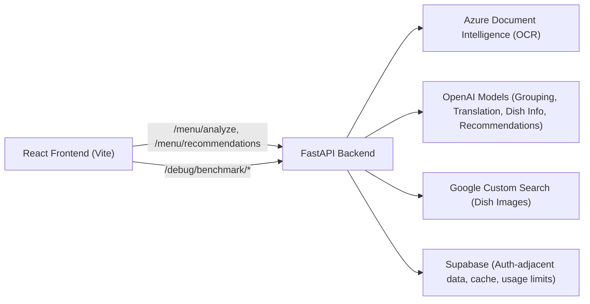
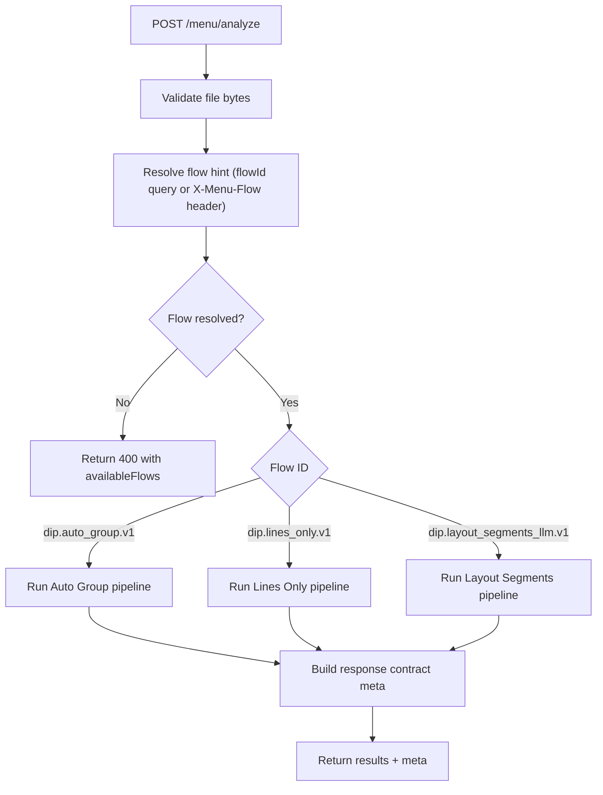
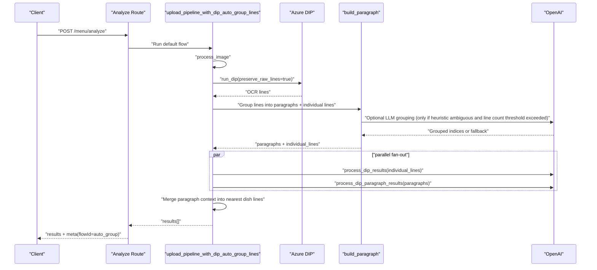
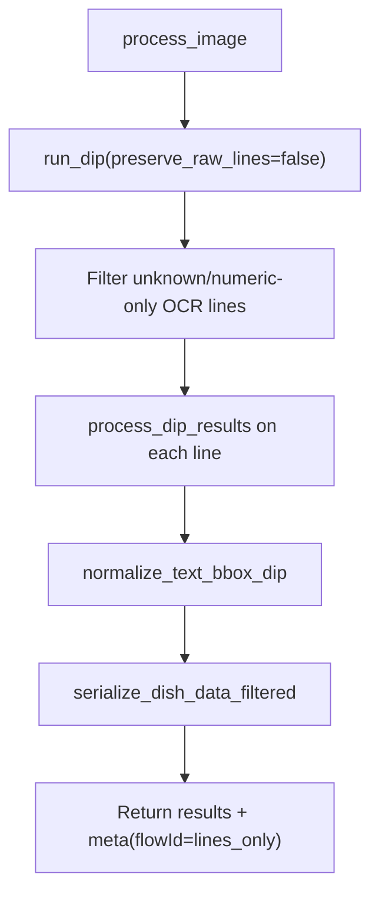
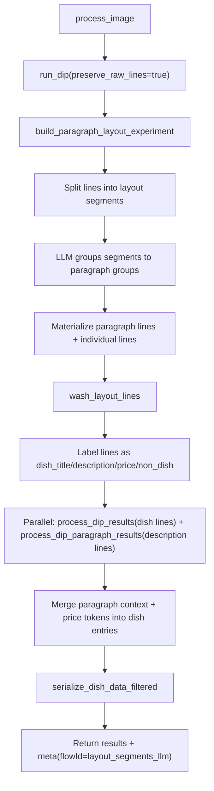

<!-- AUTOGENERATED: run ./scripts/generate-readme.sh -->
# tma

Menu image analysis platform with a React frontend and FastAPI backend.

## License

This project is source-available under the **PolyForm Noncommercial License 1.0.0**.

You may use, copy, modify, and share the code for noncommercial purposes only.
Commercial use (including using this project to generate revenue) is not allowed.

See the full license text in [`LICENSE`](LICENSE).

## Full Solution Overview

The section below is sourced from `SOLUTION_OVERVIEW.md` via `./scripts/generate-readme.sh`.

---

<!-- BEGIN: solution_overview -->
# Solution Overview

This document gives new contributors and agents a high-level map of the project, with emphasis on how backend menu analysis works.

## 1. What This Project Does

`tma` analyzes uploaded menu images and returns structured dish items with normalized bounding boxes. It also supports:

- Recommendation generation based on selected dishes
- Usage/limit tracking via Supabase
- Benchmark/debug tooling for OCR/grouping strategies

## 2. System Architecture

## 3. Repository Map

- `backend/src/main.py`: app bootstrap + lifespan initialization
- `backend/src/api/`: HTTP routes (`/menu`, `/user-info`, `/debug`)
- `backend/src/menu_engine/`: flow registry + analysis/recommendation orchestration
- `backend/src/services/menu.py`: core OCR/analyze pipelines
- `backend/src/services/ocr/`: grouping strategies (`heuristic`, `llm`, `layout experiment`)
- `frontend/src/`: UI, upload flow, flow toggle, benchmark debug page

## 4. Analyze API at a Glance

Primary endpoint: `POST /menu/analyze`

- Requires: `Authorization: Bearer <jwt>`
- Optional:
  - query `flowId`
  - header `X-Menu-Flow`
  - header `Accept-Language`

Response shape:

- `results[]`: `{ id, info, boundingBox }`
- `meta`: `flowId`, `flowLabel`, `language`, `totalItems`, `contractVersion`

## 5. Backend Analyze Flow Routing

Flow routing is handled in `MenuFlowRegistry` and `MenuAnalysisService`.

- Registered flows:
  - `dip.auto_group.v1`
  - `dip.lines_only.v1`
  - `dip.layout_segments_llm.v1` (experimental)
- Flow aliases from env, plus defaults like:
  - `fast -> dip.lines_only.v1`
  - `layoutexp -> dip.layout_segments_llm.v1`

## 6. Analyze Pipeline Details

### 6.1 Shared Building Blocks

All analyze flows depend on the same core primitives in `services/menu.py`:

1. `process_image(...)`
   - Decodes image with OpenCV
   - Resizes to max width
   - JPEG re-encodes to stay under payload constraints
2. `run_dip(...)`
   - Submits image to Azure DIP
   - Polls async operation URL
   - Normalizes polygon format to `x_coords/y_coords`
3. `process_dip_results(...)`
   - Cleans dish names
   - Deduplicates repeated dish lines
   - Calls LLM dish-info chain
   - Optionally enriches images (Google + optional Supabase cache)
4. `normalize_text_bbox_dip(...)`
   - Converts DIP polygons into normalized `[0, 1]` bounding boxes
5. `serialize_dish_data_filtered(...)`
   - Filters unknowns and emits stable output structure

### 6.2 Flow A: `dip.auto_group.v1` (Default)

This is the default path for mixed menus (title + description layouts).

Notes:

- Grouping defaults to heuristic; LLM grouping is conditional.
- If grouping fails/times out, pipeline falls back to line-level behavior.
- Paragraph context is merged spatially into dish entries.

### 6.3 Flow B: `dip.lines_only.v1` (Fast/strict line extraction)

Used by frontend "heuristic" mode today (`flowId=dip.lines_only.v1`).

Notes:

- No paragraph grouping stage.
- Lower complexity and typically lower latency.

### 6.4 Flow C: `dip.layout_segments_llm.v1` (Experimental)

This flow adds geometry-aware segmentation and a post-group "wash" pass.

Notes:

- Multiple fallback modes exist for timeout/parse/provider errors.
- `MENU_LAYOUT_ENABLE_HEURISTIC_FALLBACK` can enable additional non-LLM fallback grouping.

## 7. Frontend to Backend Flow Mapping

In `frontend/src/features/menu/services/menuUploadService.ts`:

- UI mode `heuristic` -> `flowId=dip.lines_only.v1`
- UI mode `llm` -> `flowId=dip.layout_segments_llm.v1`

`dip.auto_group.v1` remains backend default when no flow hint is provided.

## 8. Auth, Limits, and Recommendations

- Auth:
  - Backend expects JWT Bearer token
  - Decoded using `SECRET_KEY` and audience `"authenticated"`
- `/menu/recommendations`:
  - Checks remaining accesses from Supabase
  - Returns limit message if exhausted
  - Otherwise calls LLM recommendation chain and records access

## 9. Debug and Benchmark Tooling

- Benchmark runner: `backend/benchmark/run.py`
- Debug endpoints (guarded by `DEBUG_TOOLS_ENABLED`):
  - `/debug/benchmark/runs`
  - `/debug/benchmark/runs/{run_id}/summary`
  - `/debug/benchmark/runs/{run_id}/cases/{case_id}`
  - `/debug/benchmark/runs/{run_id}/cases/{case_id}/image`
- Frontend debug page route: `/debug/benchmark` with `VITE_DEBUG_TOOLS=true`

## 10. Contributor Starting Checklist

1. Read `AGENTS.md` for commands and environment setup.
2. Run backend tests first: `cd backend && uv run python -m pytest -q`.
3. For analyze changes, validate at least:
   - flow routing behavior (`flowId`, alias handling)
   - output contract (`results` + `meta`)
   - fallback behavior under grouping failures/timeouts
4. If touching OCR/grouping logic, also run benchmark scripts to compare strategy behavior.

## 11. Extension Guide: Adding a New Analyze Flow

1. Implement a new flow class in `backend/src/menu_engine/analysis.py` with `descriptor` + `run(...)`.
2. Register it in `get_menu_flow_registry()` in `backend/src/api/deps.py`.
3. Add flow id to env/config defaults as needed (`MENU_ENABLED_FLOW_IDS`, aliases).
4. Add tests under `backend/src/tests/feature` + `backend/src/tests/unit`.
5. If frontend should expose it, map a UI mode to new `flowId`.

<!-- END: solution_overview -->
